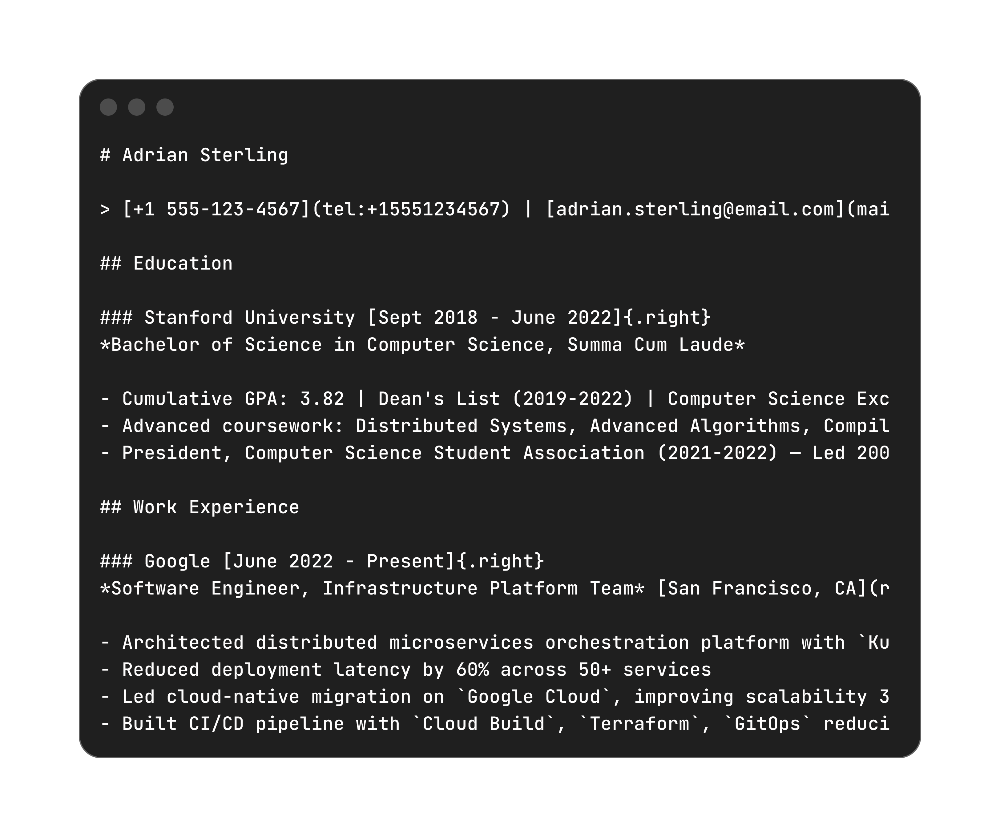
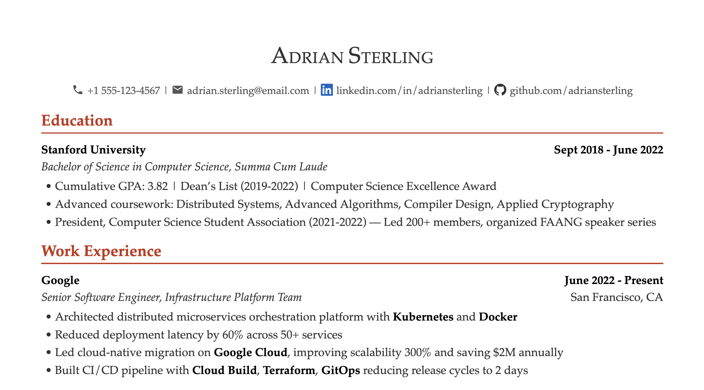

# resum8

Write your resume in markdown. Render it anywhere.

## Why resum8?

- **Freeform markdown** — No schema, no HTML, just natural prose
- **Portable** — Works with Pandoc, md-to-pdf, mdpdf, or any markdown tool
- **Own your styles** — Adopt template styles to your project, tweak it, and make it yours
- **AI-friendly** — Let AI help write and refine your resume
- **No lock-in** — Grab the stylesheet, skip the CLI entirely if you want

<div style="display: grid; grid-template-columns: 1fr 1fr; align-items: center; gap: 10px;">
    
    
</div>

## Get Started

### Option 1: Use the CLI (recommended)

```bash
npm install -g resum8

m8 init                       # Create resume.md from template
m8 init john-doe.md           # Create john-doe.md from template

m8 john-doe.md                # -> john-doe.pdf
m8 john-doe.md -s formal      # Use a specific style
m8 john-doe.md --html --word  # Render to HTML and Word
```

### Option 2: Just grab a stylesheet

Want to use your preferred tooling? Download a stylesheet and use it directly.

- [classic.css](styles/classic.css) — Elegant serif, traditional feel
- [formal.css](styles/formal.css) — Clean, professional
- [minimal.css](styles/minimal.css) — Modern, minimal

```bash
# With Pandoc
pandoc resume.md --pdf-engine=weasyprint -c classic.css -o resume.pdf

# With md-to-pdf
md-to-pdf resume.md --stylesheet classic.css

# With mdpdf
mdpdf resume.md --style classic.css

# Or other tools...
```

## Writing Your Resume

Write your resume in standard markdown syntax. Use `[text](#right)` to right-align text.

```markdown
# Jane Doe

> [jane@example.com](mailto:jane@example.com) | [linkedin.com/in/janedoe](https://linkedin.com/in/janedoe) | [github.com/janedoe](https://github.com/janedoe)

## Experience

### Acme Corp [Jan 2022 - Present](#right)
*Senior Software Engineer*  [San Francisco, CA](#right)

- Built REST API serving 10k requests/min using `Node.js` and `Redis`
- Led team of 10 engineers to deliver project on time
```

- Use a blockquote (`>`) with pipe-separated links
- The `[text](#right)` link floats right via CSS—use it for dates and locations.

See the [full syntax reference](docs/syntax.md) for tables, skills sections, and enhanced Pandoc features.

## CLI Commands

| Command | Description |
|---------|-------------|
| `m8 <file>` | Render to PDF (default) |
| `m8 <file> --html` | Render to HTML |
| `m8 <file> --word` | Render to Word (.docx) |
| `m8 <file> --all` | Render all formats |
| `m8 <file> -w` | Watch mode (auto-rebuild) |
| `m8 <file> -s <style>` | Use specific style |
| `m8 init [filename]` | Create resume from template (default: resume.md) |
| `m8 eject [style]` | Copy style to ./styles/ for customization |
| `m8 style` | List available styles |
| `m8 style -d <name>` | Set default style |

### Examples

```bash
m8 resume.md                    # → output/resume.pdf
m8 resume.md --html             # → output/resume.html
m8 resume.md --all              # → all formats
m8 resume.md -w                 # watch mode
m8 resume.md -s formal          # use formal style
m8 resume.md -o cv              # → output/cv.pdf
```

### CSS Variable Customization

Override CSS variables without ejecting:

```bash
m8 resume.md --var font-family="Arial"
m8 resume.md --var section-header-color="#0066cc"
```

Or create `resum8.config.json`:

```json
{
  "style": "formal",
  "variables": {
    "font-family": "Inter, sans-serif",
    "section-header-color": "#2563eb"
  }
}
```

## Styles

Three built-in styles: `classic` (default), `formal`, `minimal`

```bash
m8 style                # List available styles
m8 style -d formal      # Set default style
m8 resume.md -s minimal # Use a specific style (one-time)
m8 eject formal         # Copy to ./styles/ for customization
```

## Requirements

**For CLI:**
- [Node.js](https://nodejs.org/) 20+
- [Pandoc](https://pandoc.org/)
- [WeasyPrint](https://weasyprint.org/)

```bash
# macOS
brew install pandoc weasyprint
```

**For stylesheet-only:** Any markdown-to-HTML/PDF tool that supports custom CSS.

## License

MIT
