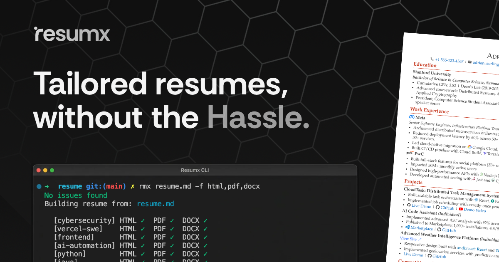

---

<p align="center">
  <a href="https://www.npmjs.com/package/resumx"></a>
</p>

<p align="center">
  <a href="https://resumx.dev/guide/"><strong>Documentation</strong></a> | 
  <a href="https://resumx.dev/playbook/resume-length"><strong>The Resume Playbook</strong></a>
</p>

Tailored resumes get [10x more interviews](https://resumx.dev/playbook/tailored-vs-generic), but most people skip it because it means managing multiple files and re-fitting everything to one page. Resumx lets you tailor for every role in a single file, and auto-fits your content to the page count you set

- **Tailoring without the overhead:** Target variants in one file (`{.@frontend}`, `{.@backend}`), each auto-fitted to your page limit.
- **Always fits the page:** Set `pages: 1` and add or remove content freely, Resumx scales typography and spacing so it always lands on exactly one page.
- **AI-friendly by default:** Plain Markdown in a single file, so AI tools can read, edit, and tailor with full context.
- **More writing, fewer decisions:** Sensible defaults for layout and structure so you focus on substance.

<!-- prettier-ignore-start -->
```markdown
---
pages: 1
style:
  section-title-caps: small-caps
---
# Jane Doe

jane@example.com | github.com/jane | linkedin.com/in/jane

[Stream Processing, Event-Driven Architecture, Distributed Systems, Go, Kafka]{.@stripe-swe}
[React, UI Performance, Design Systems, TypeScript, Next.js]{.@vercel-fe}

## Experience

### :meta: Meta || June 2022 - Present
_Senior Software Engineer_

- Built distributed systems serving 1M requests/day {.@frontend}
- Built interactive dashboards using :ts: TypeScript {.@vercel-swe}

## Technical Skills
::: {.grid .grid-cols-2}
- TypeScript
- React
- Vue
- PostgreSQL
:::
```
<!-- prettier-ignore-end -->

Render with:

```bash
resumx resume.md --format pdf,docx,html
```


## Quick Start

**Install:**

```bash
npm install -g resumx
npx playwright install chromium
```

### Optional Dependencies

For **DOCX export** (`--format docx`), install pdf2docx:

```bash
# Using pip
pip install pdf2docx

# Using pipx
pipx install pdf2docx

# Using uv
uv tool install pdf2docx
```

**Run:**

```bash
resumx init resume.md     # Generate a template resume
resumx resume.md --watch  # Live preview
```

## Install Agent Skills

```bash
npx skills add resumx/resumx
```

This enables AI assistants like Cursor, Claude Code, and Copilot to understand and work with your Resumx files.

<!-- TODO: image for terminal output of resumx init + render -->

## CLI

| Command                                | Description             |
| -------------------------------------- | ----------------------- |
| `resumx [file]`                        | Render to PDF (default) |
| `resumx [file] --watch`                | Live preview            |
| `resumx [file] --css my-styles.css`    | Custom CSS file         |
| `resumx [file] --target frontend`      | Target-specific output  |
| `resumx [file] --format pdf,html,docx` | PDF + HTML + DOCX       |
| `resumx [file] --pages 1`              | Fit to 1 page           |
| `resumx init`                          | Create from template    |

See the full [CLI Reference](https://resumx.dev/guide/cli-reference).

## Documentation

For full documentation, visit [resumx.dev](https://resumx.dev/guide).

## License

[Apache License 2.0](LICENSE)
